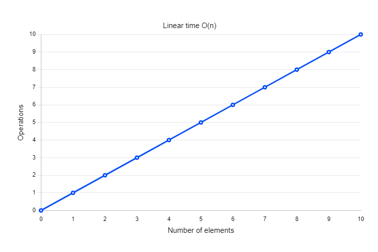

<h3>Details about  Big-O time complexity</h3>

<p>What are the key features of good code?</p>

1. Readable
2. Scalable
   - Managed time complexity (Big-O)
   - Managed space complexity

<p>There are different types of Big-O notations:</p>

1. O(n)
2. O(1)
3. O(n^2)
4. O(2^n)
5. O(n!)
6. O(log n)
7. O(n log n)

<p>We will discusses about different notation of Big-O step by step.</p>

<h3><b>O(n)</b></h3>
When the algorithm has linear time complexity then it is called O(n)

<p>The number of operations will depend on the number of array elements.</p>

<p>Here is an example of O(1) time complexity.</p>

``` javascript
const names = ['abc','def','xyz']

for(let i = 0; i < names.length; i++){
  if(names[i] == 'xyz'){
    console.log('Hello '+ names[i]);
  }
}
```




<p>If we look at the upper graph, the number of orations is dependent on the array of elements.</p>
<p>If n = 0, operations= 0</p>
<p>If n = 1, operations= 1</p>
<p>If n = 2, operations= 2</p>
<p>If n = 3, operations= 3</p>
<p>and so on</p>


<h3><b>O(1)</b></h3>
When time is constant to execute an algorithm then the time complexity of the algorithm is O(1)

<p>Here is an example of O(1) time complexity.</p>

``` javascript
const names = ['abc','def','xyz'];
const namesObject = {
  'abc': true,
  'def': true,
  'xyx': true
};

let elementExistInArray = !!namesObject['xyx']; // namesObject['xyx'] ? true : false;

console.log(elementExistInArray);
```